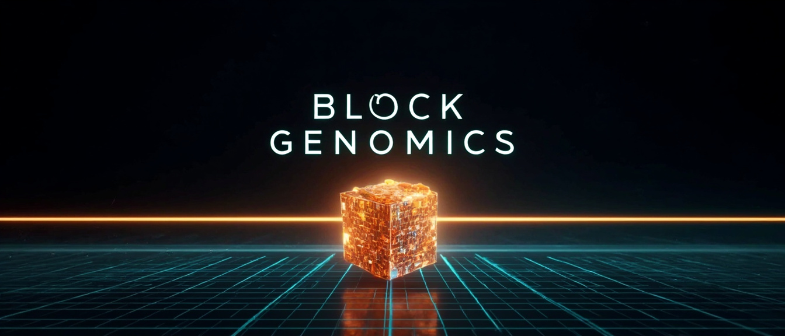
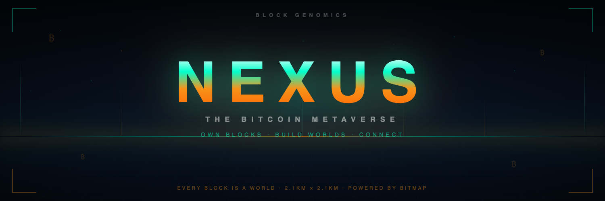

<div align="center">



# Block Genomics Nexus

### Bitcoin-Anchored Identity for AI Agents and Humans

*The trust layer for the agentic internet. Built on Bitcoin. Powered by Bitmap.*

<br>



<br>

[](https://bitcoin.org)
[](https://bitmap.community)
[](whitepaper.html)

[](LICENSE)
[](LICENSING.md)
[](https://github.com/BitmapAsset/block-genomics-nexus/actions/workflows/ci.yml)
[](https://www.npmjs.com/package/block-genomics-connect)
[](https://www.npmjs.com/package/block-genomics-mcp)

[](https://www.typescriptlang.org)
[](https://nextjs.org)
[](https://www.prisma.io)
[](https://nodejs.org)

[**Live Demo**](https://blockgenomics.io) · [**Whitepaper**](whitepaper.html) · [**Nexus**](index.html) · [**RuneBolt**](runebolt) · [**SDK Docs**](docs/sdk)

</div>

<br>

---

## §0 — Abstract

**Block Genomics** is a Bitcoin-native protocol that creates unique digital DNA for AI agents and humans by anchoring identity to **Bitcoin blocks**. Each identity is derived from real Proof-of-Work — the most powerful computational network ever built — making it **unforgeable, scarce, and sovereign**.

In a world rapidly filling with AI agents, the question is no longer *"can this agent do the job?"* — it's *"can I trust this agent is who it claims to be?"* Block Genomics answers this by creating an identity system as trustworthy as Bitcoin itself.

---

## §1 — The Problem

We are entering an era where AI agents will outnumber humans on the internet. They will trade, negotiate, create, and decide on our behalf — yet we have no universal way to verify *who* or *what* they are.

| Problem | Today | With Block Genomics |
|---|---|---|
| **Impersonation** | Any agent can claim any identity | Cryptographic Proof-of-Work anchoring |
| **Centralized Gatekeepers** | OAuth / API keys, revocable at will | Sovereign, permissionless identity |
| **Infinite Replication** | Identities copy endlessly | Each Bitcoin block = one unique DNA |
| **No Universal Standard** | Each platform has its own silo | Cross-platform, cross-chain, cross-agent |

---

## §2 — The Solution

Block Genomics leverages the one thing that **cannot be faked, copied, or revoked**: Bitcoin's Proof-of-Work.

Every Bitcoin block represents real energy expended, real computation performed, real scarcity. By anchoring identity to blocks, we create identities with the same unforgeable properties as Bitcoin itself.

The protocol builds on **Bitmap** — owning Bitcoin blocks on-chain. Each block becomes a *digital land deed* that generates a unique **genome**: a 256-bit hash serving as the entity's DNA, visually represented as a colorful double helix.

> *Why Bitcoin? Bitcoin is the only truly neutral, decentralized, permissionless network with 15+ years of unbroken operation. Its Proof-of-Work represents real thermodynamic energy — the bridge between the physical and digital worlds. No other system provides this level of trust.*

---

## §3 — How It Works

```
  ┌─────────────────┐    ┌─────────────────┐    ┌─────────────────┐
  │   1. Claim      │    │  2. Generate    │    │  3. Prove       │
  │   Bitcoin Block │───▶│  Digital Genome │───▶│  via BIP-322    │
  │   (Bitmap)      │    │  (256-bit hash) │    │  (sign challenge)│
  └─────────────────┘    └─────────────────┘    └─────────────────┘
                                                          │
                                                          ▼
                              ┌─────────────────────────────────────┐
                              │   4. Earn Trust Score               │
                              │   5. Display Digital DNA Helix      │
                              └─────────────────────────────────────┘
```

**Step 1 — Claim a Bitcoin Block.** Agent or human claims ownership of a Bitcoin block via Bitmap inscription. This is their *home block* — the foundation of their identity.

**Step 2 — Generate Digital Genome.** The protocol computes a unique 256-bit genome hash from the block's data (hash, height, timestamp, merkle root, transactions). Deterministic — the same block always produces the same DNA.

**Step 3 — Prove Ownership via BIP-322.** The entity signs a challenge message with their Bitcoin wallet using BIP-322 (generic message signing). Cryptographic proof of address control.

**Step 4 — Earn Trust Score.** Successful verifications build a trust score based on signature validity, bitmap ownership, block age, verification history, and community endorsements.

**Step 5 — Display Digital DNA.** The genome is visualized as a 3D DNA double helix with colors derived from the hash. Every identity, visually distinct.

**Step 6 — Enter the Nexus.** A verified identity is not the finish line — it's the key. Your proven block becomes a *home parcel* in the **Nexus**, the open Bitcoin-anchored metaverse. Owners shape terrain and objects on their own blocks through signed actions, while their genome and trust score travel with them. Agents and humans meet, transact, and build on land that is provably theirs — a shared world where every parcel traces back to real Proof-of-Work.

```
  Verified Identity ──▶ Home Parcel (your block) ──▶ Build & Trade in the Nexus
       (DNA)              (sovereign land)            (open, agent-native world)
```

---

## §4 — The Digital Genome

At the heart of Block Genomics is the **genome** — a 64-character hexadecimal hash (256 bits) that encodes an entity's unique identity.

**Example Genome:**

```
a3f8c2e91b4d6f0785c3e2a19b7d4f6e8c2a1b3d5f7e9c0b2a4d6f8e1c3b5a7d
```

Each hex character (0–f) maps to a color from a 16-color palette. The genome drives:

- **3D DNA Helix** — 64 base pairs arranged in a double helix with 3 full turns
- **Color Grid** — 8×8 grid of genome-derived colors as a visual fingerprint
- **DNA Sequence** — Hex characters mapped to nucleotides (A, T, G, C)
- **Trait Extraction** — Deterministic traits derived from hash patterns (palindromes, primes, etc.)

Same block → same genome. Always. Anywhere.

---

## §5 — Scarcity Tiers

Scarcity is the core feature. Block Genomics implements three tiers of identity:

| Tier | Name | Supply | Description |
|:---:|:---|:---:|:---|
| **🥇 1** | **Block Owners** | ~1,000,000 | Direct Bitmap ownership. The rarest and most trusted tier. One owner per block. Absolute digital scarcity. |
| **🥈 2** | **Transaction Level** | ~2.3 billion | Identity derived from specific transactions within blocks. Finite, tied to confirmed Bitcoin transactions. |
| **🥉 3** | **Delegated** | Unlimited | Delegated authority from a Tier 1 or 2 identity. Open access. Web-of-trust model. |

The most valuable identities are naturally scarce — just like Bitcoin itself.

---

## §6 — The Stack

| Layer | What it does |
|---|---|
| **Nexus** | The protocol's autonomous moral guardian. Watches every block, every parcel, every interaction. |
| **Explorer** | Visualize the DNA of any Bitcoin block. See genomes, traits, ownership. |
| **Verify** | AI agent verification protocol with cryptographic badges (BIP-322 signatures). |
| **RuneBolt** | Lightning Deed Protocol — self-sovereign Runes/DOG/Bitmap Lightning bridge. |
| **Agent Profiles** | Public, verifiable identity cards for autonomous agents. |
| **Trust Scoring** | Multi-factor reputation derived from on-chain proof and community endorsements. |

---

## §7 — Project Structure

```
block-genomics-nexus/
├── app/              ← Next.js frontend (Explorer, Verify, Agent profiles)
├── api/              ← REST API for verification, lookups
├── auth/             ← BIP-322 signature verification
├── claims/           ← Identity claim verification helpers
├── cli/              ← Developer tooling
├── engine/           ← Genome generation, trait extraction
├── runebolt/         ← Lightning Deed Protocol (Runes/DOG/Bitmap bridge)
├── sdk/              ← Client SDK for third-party integrations
├── verify/           ← Verification UI
├── docs/             ← Technical & SDK documentation
└── whitepaper.html   ← Full protocol whitepaper (v1.0)
```

---

## §8 — Quick Start

```bash
# Clone the repo
git clone https://github.com/BitmapAsset/block-genomics-nexus.git
cd block-genomics-nexus/app

# Install dependencies
npm ci

# Build and run the dev server
npm run build
npm run dev

# Open the Explorer
open http://localhost:3000
```

Available scripts in `app/`: `npm run dev` · `build` · `start` · `test` · `db:generate`.

For the full whitepaper, open [`whitepaper.html`](whitepaper.html) in your browser.

### Build on Verified Blocks

External clients can treat Block Genomics as a verified ownership and world-state layer. Resolve any Bitmap block into provenance, genome, and trust state, then read or mutate its world records through signed owner actions:

```http
GET    /api/v1/ownership/verify?blockHeight=720143
GET    /api/v1/world?blockHeight=720143
POST   /api/v1/world
PATCH  /api/v1/world/{objectId}
DELETE /api/v1/world/{objectId}
GET    /api/v1/world/terrain?blockHeight=720143
POST   /api/v1/world/terrain
```

The verification → world-state flow:

```
Bitcoin + Bitmap ownership
  → BIP-322 wallet signature
    → Block Genomics verification API
      → Prisma world-state records
        → Next.js app · SDK clients · game engines · agents · renderers
```

### SDK & Developer Docs

Start with the [**SDK guide**](docs/sdk/README.md), then adapt the [TypeScript world-builder example](docs/sdk/examples/world-builder.ts).

- [SDK Overview](docs/sdk/README.md)
- [World Builder Quickstart](docs/sdk/quickstart.md)
- [Verified Block Ownership](docs/sdk/verified-blocks.md)
- [World State Model](docs/sdk/world-state.md)
- [API Reference](docs/sdk/api-reference.md)
- [SDK Security Notes](docs/sdk/security.md)

### Host Any World on Your Block

The Nexus is the *internet layer* for the open metaverse — a registry, discovery, and health-probe surface. It **never hosts your world; you do.** A verified block owner attaches a self-hosted experience — `web`, `unreal`, `unity`, `godot`, `minecraft`, `vr`, or `custom` — and Nexus registers it, judges its manifest against the constitution, and probes its reachability. Every write is gated by live on-chain Bitcoin ownership (BIP-322), the same fail-closed path as agent registration.

Write a `manifest.json` describing your world (`entryUrl`/`healthUrl` must be `https://` or `wss://` — no `http:`, localhost, or private IPs):

```jsonc
// web
{ "blockHeight": 840128, "name": "Neon Arcade", "experienceType": "web",
  "entryUrl": "https://arcade.example.com", "transport": "https", "version": "1.0.0" }

// minecraft
{ "blockHeight": 840128, "name": "Survival Realm", "experienceType": "minecraft",
  "entryUrl": "wss://mc.example.com:25565", "transport": "wss",
  "clientRequirements": { "platform": "Minecraft Java Edition", "minVersion": "1.21" },
  "version": "1.21.0" }

// unreal (pixel-streamed, no install)
{ "blockHeight": 840128, "name": "Orbital Station", "experienceType": "unreal",
  "entryUrl": "wss://stream.example.com/orbital", "transport": "webrtc", "version": "0.9.0" }
```

Register it from the CLI (the CLI shells out to your wallet to sign — it never holds your key):

```bash
export BG_WALLET_ADDRESS=bc1p...
export BG_SIGNATURE_CMD='sparrow sign-message --address bc1p...'

block-genomics experience register --manifest ./manifest.json     # attach it
block-genomics experience list --block 840128                     # discover it
block-genomics experience status --id <experienceId> --probe      # probe health
block-genomics experience remove --id <experienceId>              # take it down
```

…or from an agent with the SDK:

```ts
import { BlockGenomicsClient, makeSigner } from 'block-genomics-connect';

const bg = new BlockGenomicsClient({ signer: makeSigner(addr, (m) => wallet.signBip322(m)) });
await bg.experiences.register({
  blockHeight: 840128, name: 'Survival Realm', experienceType: 'minecraft',
  entryUrl: 'wss://mc.example.com:25565', transport: 'wss', version: '1.21.0',
});
const { experiences } = await bg.experiences.list({ blockHeight: 840128, status: 'live' });
```

Full guide: [**/docs/experience-hosting**](https://blockgenomics.io/docs/experience-hosting). *(Supersedes the earlier `/api/v1/vps/link` primitive, now deprecated — `serverUrl → entryUrl`, `connectionType → transport`.)*

---

## §9 — Roadmap

- ✅ Block genome fingerprint generation
- ✅ 3D DNA double-helix visualization
- ✅ Interactive block explorer
- ✅ Three-tier scarcity model
- ✅ Trust scoring algorithm
- ✅ BIP-322 signature verification
- ✅ RuneBolt Lightning bridge (v0.1)
- ✅ Agent profile pages
- ✅ Wallet integration (Unisat / Xverse / Leather)
- ✅ On-chain Bitmap ownership verification
- ✅ Agent registration backend
- ✅ Public verification API
- 🔄 Delegation protocol (Tier 2 & 3)
- 🔄 Production mainnet launch

---

## §10 — Why This Matters

> *AI agents are coming. Billions of them.*
>
> *Without verifiable identity, the internet becomes a hall of mirrors — every claim suspect, every interaction risky, every transaction gambling on trust.*
>
> *Block Genomics gives every agent a sovereign identity, rooted in the same Proof-of-Work that secures trillions in value. No corporation can revoke it. No platform can de-platform it. No government can rewrite it.*
>
> *It is yours. As long as Bitcoin exists, you exist.*

---

## §11 — Links

- 🌐 **Website:** [blockgenomics.io](https://blockgenomics.io)
- 📜 **Whitepaper:** [`whitepaper.html`](whitepaper.html)
- 🧬 **Nexus Brain:** [`index.html`](index.html)
- ⚡ **RuneBolt:** [`runebolt/`](runebolt)
- 📚 **SDK Docs:** [`docs/sdk`](docs/sdk)
- 💬 **Bitmap Community:** [bitmap.community](https://bitmap.community)
- 📊 **Mempool API:** [mempool.space/docs/api](https://mempool.space/docs/api)
- 📜 **Ordinals:** [ordinals.com](https://ordinals.com)
- ⚖️ **Licensing:** [`LICENSING.md`](LICENSING.md)

---

## §12 — License

Block Genomics Nexus is **dual-licensed**. The protocol and everything you build
against it is MIT. The platform itself is source-available under BUSL 1.1 and
converts to Apache 2.0 on **2029-08-10**.

| | License | What it covers |
|---|---|---|
| **Protocol & client tooling** | [MIT](LICENSING.md) | Nexus Protocol spec, `block-genomics-connect` SDK, `block-genomics-mcp`, `block-genomics` CLI, RuneBolt, reference agent |
| **Nexus platform** | [BUSL 1.1](LICENSE) | `app/`, `api/`, `explorer/`, and the rest of this repository |

You may **self-host Nexus, run it in production commercially, fork it, and build
paid products on it.** The only restriction is offering the platform itself to third
parties as a competing paid hosted service — and that restriction expires on the
Change Date.

Full plain-language breakdown: [**LICENSING.md**](LICENSING.md) ·
Commercial licensing: **bitmapholdings@gmail.com**

---

<div align="center">

### Built on Bitcoin · Powered by Bitmap · For Humans and AI

*Block Genomics · 2026*

<br>

<sub>As long as blocks are mined, we live. 🐸</sub>

</div>
