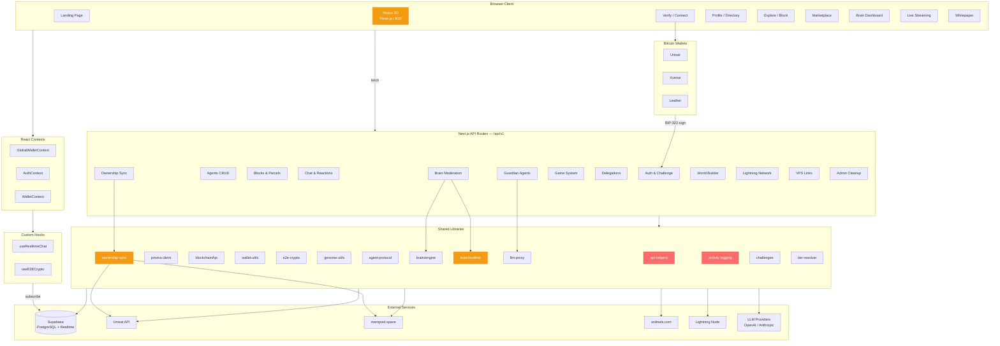

# Block Genomics — Architecture Review

**Date**: 2026-03-16
**Reviewer**: Principal Architect (automated)
**Version**: 21.0.0
**Stack**: Next.js 15 / React 19 / Prisma 6 / Supabase / Three.js / TypeScript 5.8

---

## Architecture Diagram

---

## Module Quality Grades

| Module | Grade | Rationale |
|--------|-------|-----------|
| **types/** | A | Well-defined interfaces, barrel exports, good coverage of domain types |
| **prisma/schema** | A | 24+ models, proper relations, composite keys, comprehensive domain model |
| **lib/e2e-crypto** | A- | Strong cryptographic implementation (secp256k1 ECDH + AES-256-GCM + HKDF) |
| **lib/protocol** | A- | Clean constants, tier definitions, fee structures as typed objects |
| **lib/genome-utils** | B+ | Good SHA-256 genome generation, missing return type annotations |
| **lib/brain/** | B+ | Autonomous moderation engine with hash chain integrity — heavy console.log |
| **hooks/** | B | Functional realtime & crypto hooks — missing return type annotations |
| **context/** | B | Clean provider pattern — non-null assertions on env vars |
| **components/nexus/** | B- | Feature-rich 3D world — ParcelView.tsx is 7000+ lines with 34 `any` types |
| **lib/api-helpers** | C+ | Core helper used everywhere — `success()` accepts `any`, no generics |
| **lib/wallet-utils** | C+ | Good multi-wallet support — 9 `any` types, console.log in production paths |
| **lib/blockchainApi** | C | External API integration — 4 `any` types, limited error recovery |
| **lib/ownership-sync** | C | Critical ownership code — 6 `any` types, error masking |
| **lib/activity** | C- | All functions accept `any` metadata, empty catch blocks silently swallow errors |
| **lib/challenges** | C- | In-memory store — no persistence, no return types, will lose state on restart |
| **API routes** | C | 87 routes, consistent `success`/`error` pattern — but `catch (e: any)` everywhere |
| **lib/supabase** | C- | Non-null assertions on env vars — will crash silently if misconfigured |
| **tests/** | D | Single e2e test file with 15 tests — no unit tests, no integration tests |
| **components/auth/** | B | Clean wallet connection UI — relies on untyped wallet provider APIs |
| **Documentation** | B+ | Good README, PROTOCOL.md, API.md — no inline JSDoc on most functions |

---

## Top 20 Issues

### Critical (Fix Now)

| # | Issue | Location | Impact |
|---|-------|----------|--------|
| 1 | **`any` type epidemic** — 156+ usages across 80 files | Codebase-wide | Type safety completely undermined; refactoring errors won't be caught |
| 2 | **Empty catch blocks** — 40 occurrences silently swallow errors | `activity.ts`, `ParcelView.tsx`, API routes | Bugs become invisible; debugging is guesswork |
| 3 | **In-memory challenge store** — nonces lost on server restart/redeploy | `lib/challenges.ts` | Auth replay attacks possible after redeploy; verification will fail mid-flow |
| 4 | **In-memory rate limiter** — resets on every deploy | `chat/[blockHeight]/route.ts` | Rate limiting ineffective in serverless/multi-instance deployment |
| 5 | **No test coverage** — 1 e2e file, 0 unit tests | `tests/` | Regressions ship to production undetected |

### High (Fix Soon)

| # | Issue | Location | Impact |
|---|-------|----------|--------|
| 6 | **`catch (e: any)` pattern** in all 87 API routes | All `route.ts` files | Errors are untyped; stack traces may leak in non-500 responses |
| 7 | **Non-null assertions on env vars** | `supabase.ts:3-4` | App crashes with unhelpful error if env vars missing |
| 8 | **TODO: verify txId on-chain** — delegation purchase skips on-chain verification | `delegations/purchase/route.ts:31` | Users can fake transaction IDs to steal delegations |
| 9 | **Badge tier hardcoded** — `TODO: Look up actual tier from DB` | `badge/[id]/route.ts:26` | All badges show Tier 1 regardless of actual tier |
| 10 | **ParcelView.tsx is 7000+ lines** — god component | `components/nexus/ParcelView.tsx` | Unmaintainable, slow to parse, impossible to test in isolation |

### Medium (Plan Fix)

| # | Issue | Location | Impact |
|---|-------|----------|--------|
| 11 | **220+ console.log/warn/error** in production code | Codebase-wide | Log noise, potential data leaks, performance overhead |
| 12 | **BIP-322 taproot fallback** — accepts any 64+ byte base64 as valid signature | `api-helpers.ts:37-41` | Weak authentication for taproot (bc1p) addresses |
| 13 | **No API rate limiting** beyond chat — missing on auth, registration, search | API routes | Abuse potential: brute-force challenges, scrape user data |
| 14 | **JSON fields stored as strings** — `permissions`, `stats`, `inventory` | Prisma schema / routes | No schema validation on JSON blobs; corrupt data possible |
| 15 | **Missing return type annotations** on 30+ exported functions | `lib/`, `hooks/`, API routes | IDE inference works but API contracts are implicit |
| 16 | **Supabase Realtime singleton** — no reconnection handling | `lib/supabase.ts`, `useRealtimeChat.ts` | Stale connections after network interruptions |

### Low (Track)

| # | Issue | Location | Impact |
|---|-------|----------|--------|
| 17 | **6 stale TODO comments** — some are security-critical | `ParcelView.tsx`, `purchase/route.ts` | Incomplete features shipped as "done" |
| 18 | **No request validation middleware** — each route validates independently | All API routes | Inconsistent validation, duplicated logic |
| 19 | **`require('bip322-js')` dynamic import** in `verifyWalletSignature` | `api-helpers.ts:31` | Prevents tree-shaking; import at module level instead |
| 20 | **No connection pooling config** for Prisma | `lib/prisma.ts` | Default pool may exhaust connections under load on serverless |

---

## Scalability Concerns

| Area | Current | Risk | Recommendation |
|------|---------|------|----------------|
| **Challenge store** | In-memory `Map` | Lost on redeploy; no cross-instance sharing | Migrate to Redis or database |
| **Rate limiter** | In-memory `Map` | Ineffective in serverless | Use Upstash Redis or Vercel KV |
| **Prisma connections** | Default pool (5) | Exhaustion under concurrent serverless invocations | Configure `connection_limit` in DATABASE_URL, use Prisma Accelerate |
| **Supabase Realtime** | Single client, 10 events/s | No reconnection; channel limit unknown | Add exponential backoff reconnection |
| **Brain cron** | Every 5 min via Vercel Cron | Single instance, no locking | Add distributed lock to prevent duplicate runs |
| **Ownership cron** | Every 15 min | Scans all blocks sequentially | Add batching, progress tracking, resume capability |
| **ParcelView.tsx** | 7000+ lines, 34 `any` types | Bundle size, parse time, memory | Split into sub-components (<500 lines each) |

---

## Test Coverage Analysis

| Category | Files | Tests | Coverage |
|----------|-------|-------|----------|
| Unit tests | 0 | 0 | 0% |
| Integration tests | 0 | 0 | 0% |
| E2E tests | 1 | 15 | ~5% of routes |
| **Total** | **1** | **15** | **~2%** |

**Critical untested areas**: BIP-322 verification, genome generation, brain engine, ownership sync, encryption, delegation purchase, guardian chat.

---

## Recommendations Summary

1. **Immediate**: Fix `api-helpers.ts` with generics, add types to `activity.ts` (done in this review)
2. **Week 1**: Migrate challenges/rate-limiter to Redis; add on-chain tx verification for delegations
3. **Week 2**: Split ParcelView.tsx into sub-components; add unit tests for `lib/` modules
4. **Week 3**: Add request validation middleware (zod); strip console.log from production
5. **Month 1**: Achieve 60%+ test coverage on `lib/` and API routes; add proper error logging (Sentry/Axiom)

---

*Generated by automated architecture review — 2026-03-16*
