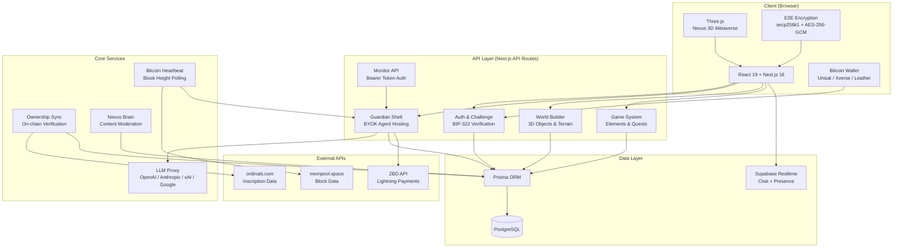
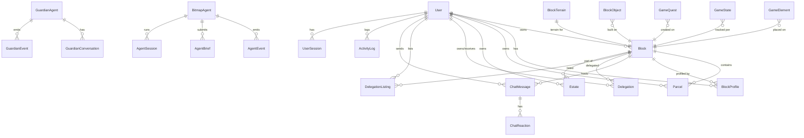
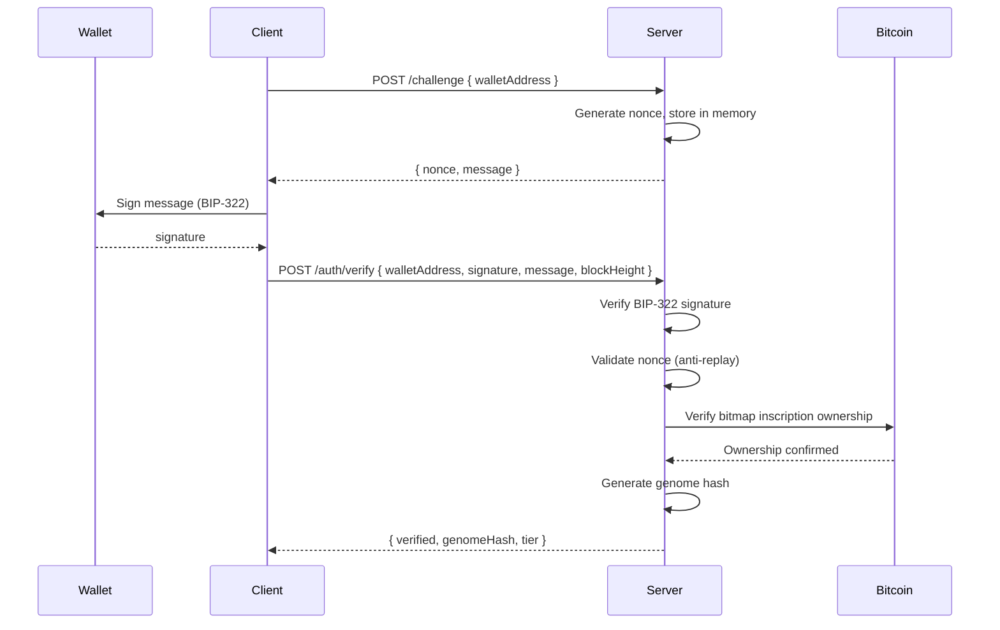
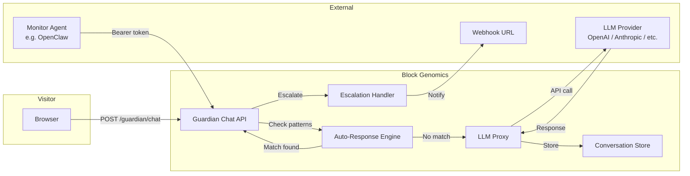
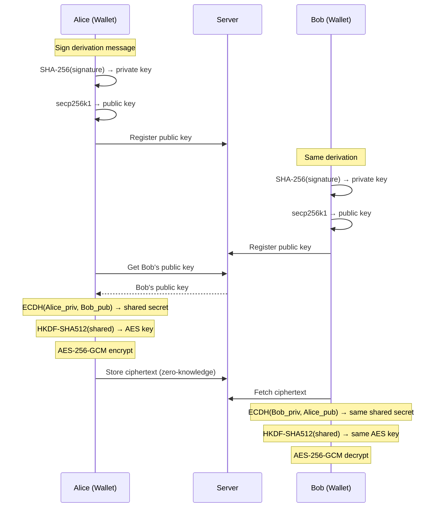

# Block Genomics Architecture Guide

A technical guide for contributors. Covers system design, database schema, component hierarchy, and deployment.

---

## System Overview



---

## Directory Structure

```
src/
├── app/                          # Next.js App Router
│   ├── api/v1/                   # API routes (67+ endpoints)
│   │   ├── auth/                 # Challenge + verify
│   │   ├── users/                # User CRUD
│   │   ├── profiles/             # Block profiles
│   │   ├── blocks/               # Block data + parcels
│   │   ├── agents/               # Bitmap agents
│   │   ├── guardian/             # Guardian Shell + Monitor API
│   │   ├── game/                 # Game elements, quests, state
│   │   ├── world/                # World objects + terrain
│   │   ├── delegations/          # Delegation marketplace
│   │   ├── estates/              # Estate management
│   │   ├── ownership/            # Ownership verification
│   │   ├── encryption/           # E2E public keys
│   │   ├── lightning/            # Lightning invoices
│   │   ├── inscriptions/         # Inscription scanning
│   │   ├── brain/                # Nexus Brain moderation
│   │   ├── vps/                  # VPS agent links
│   │   ├── heartbeat/            # Bitcoin block heartbeat
│   │   └── admin/                # Admin endpoints
│   ├── agent/[handle]/           # Agent profile page
│   ├── block/[height]/           # Block detail page
│   ├── nexus/                    # 3D metaverse
│   ├── verify/                   # Wallet verification flow
│   ├── profile/                  # User command center
│   ├── explore/                  # Block explorer
│   ├── directory/                # User directory
│   ├── marketplace/              # Delegation marketplace
│   ├── history/                  # Activity history
│   ├── runebolt/                 # RuneBolt Lightning bridge
│   ├── layout.tsx                # Root layout + providers
│   ├── page.tsx                  # Landing page
│   └── globals.css               # Tailwind + custom CSS
│
├── components/
│   ├── nexus/                    # 3D Nexus components
│   │   ├── NexusCanvas.ts        # Three.js scene setup
│   │   ├── NexusMap.tsx          # Main 3D canvas
│   │   ├── WorldBuilderPanel.tsx # 3D editor UI
│   │   ├── ParcelView.tsx        # Parcel customization
│   │   ├── WorldObjects.tsx      # Object rendering
│   │   ├── TransferPrepModal.tsx # Block transfer UI
│   │   └── UpgradeModal.tsx      # Tier upgrade UI
│   ├── auth/
│   │   └── WalletConnect.tsx     # Wallet connection modal
│   ├── Header.tsx                # Navigation header
│   ├── Footer.tsx                # Footer with live stats
│   ├── LandingPage.tsx           # Landing page wrapper
│   ├── LandingBackground.tsx     # WebGL particle background
│   ├── LandingReveal.tsx         # Fade-in animation
│   ├── LiveStats.tsx             # Network statistics
│   ├── LightningPayModal.tsx     # Lightning payment UI
│   ├── ErrorBoundary.tsx         # React error boundary
│   ├── WebGLErrorBoundary.tsx    # WebGL-specific errors
│   ├── LoadingSkeleton.tsx       # Reusable skeleton loader
│   ├── NotificationBanner.tsx    # Toast notifications
│   └── PageTransition.tsx        # Page transition animation
│
├── context/
│   ├── GlobalWalletContext.tsx    # Primary wallet state + E2E
│   ├── AuthContext.tsx           # Legacy auth context
│   └── NotificationContext.tsx   # Toast notification system
│
├── hooks/
│   ├── useStats.ts               # Network stats with caching
│   ├── useModalClose.ts          # Outside click + ESC detection
│   └── useBlockHeight.ts         # Live block height tracker
│
├── lib/
│   ├── protocol.ts               # Protocol constants + tiers
│   ├── genome-utils.ts           # Genome generation + traits
│   ├── blockchainApi.ts          # Bitcoin block data fetching
│   ├── bitcoin-heartbeat.ts      # Block heartbeat + agent health
│   ├── challenges.ts             # Challenge nonce store
│   ├── agent-protocol.ts         # Agent permissions + types
│   ├── ownership-sync.ts         # On-chain ownership verification
│   ├── game-logic.ts             # Game mechanics + achievements
│   ├── llm-proxy.ts              # LLM router + rate limiting
│   ├── monitor-tokens.ts         # Monitor token generation
│   ├── guardian-templates.ts     # Guardian file templates
│   ├── guardian-notify.ts        # Webhook push notifications
│   ├── e2e-crypto.ts             # End-to-end encryption
│   ├── wallet-utils.ts           # Wallet connection helpers
│   ├── api-helpers.ts            # Response formatting
│   ├── auth-storage.ts           # Client-side auth persistence
│   ├── key-encryption.ts         # AES-256-GCM key encryption
│   ├── connection-string.ts      # Monitor connection strings
│   ├── lightning.ts              # Lightning Network (ZBD)
│   ├── square-packing.ts         # Mondrian layout algorithm
│   ├── bitmapStandard.ts         # Bitmap grid layout
│   ├── bitmap-renderer.ts        # Server-side PNG rendering
│   ├── tier-resolver.ts          # On-chain tier resolution
│   ├── activity.ts               # Activity logging
│   ├── client-crypto.ts          # Browser SHA-256
│   ├── prisma.ts                 # Prisma client singleton
│   ├── supabase.ts               # Supabase client singleton
│   ├── runebolt-utils.ts         # Tailwind merge + formatters
│   └── brain/                    # Nexus Brain engine
│
├── types/
│   └── wallet.d.ts               # Wallet type definitions
│
prisma/
├── schema.prisma                 # Database schema
└── migrations/                   # Migration history

runebolt/                         # Lightning bridge (Express.js)
├── src/server.js                 # Express server
└── package.json                  # Separate dependencies
```

---

## Provider Hierarchy

The root layout wraps the app in nested context providers:

```
<html>
  <body>
    <GlobalWalletProvider>          ← Wallet connection, signing, E2E, tier resolution
      <AuthProvider>               ← Legacy auth state
        <NotificationProvider>     ← Toast notifications
          <Header />
          <NotificationBanner />
          <ErrorBoundary>
            <PageTransition>
              {children}           ← Page content
            </PageTransition>
          </ErrorBoundary>
          <Footer />
        </NotificationProvider>
      </AuthProvider>
    </GlobalWalletProvider>
  </body>
</html>
```

### GlobalWalletContext (Primary State)

The main state container for wallet and user data:

```typescript
interface GlobalWalletState {
  isConnected: boolean;
  isConnecting: boolean;
  walletAddress: string | null;
  walletType: WalletType | null;
  profile: UserProfile | null;
  availableWallets: WalletType[];
  error: string | null;
  tierResolution: TierResolution | null;
}
```

Key behaviors:
- Auto-reconnects from localStorage on mount
- Polls for wallet account changes every 5 seconds
- Derives E2E encryption keypair from wallet signature
- Resolves user tier from on-chain data
- Cleans up keys on disconnect

---

## Database Schema

### Entity Relationship Diagram



### Core Tables

| Table | Primary Key | Purpose |
|-------|------------|---------|
| `User` | `walletAddress` | Wallet-based user identity |
| `Block` | `height` | Bitcoin block metadata + ownership |
| `Parcel` | `(blockHeight, txIndex)` | Sub-block parcels (tx-level) |
| `BlockProfile` | `id` (unique: `walletAddress+blockHeight`) | Per-block per-wallet profiles |
| `Estate` | `id` | Named groupings of parcels |

### Guardian & Agent Tables

| Table | Purpose |
|-------|---------|
| `GuardianAgent` | AI agent config (LLM key encrypted, SOUL/AGENT/SKILLS markdown) |
| `GuardianConversation` | Visitor conversation history (messages as JSON) |
| `GuardianEvent` | Escalations, flags, errors |
| `BitmapAgent` | Generic agent registrations with heartbeat |
| `AgentEvent` | Agent-emitted events |
| `AgentBrief` | Periodic agent summaries |
| `AgentSession` | Agent sandbox sessions |
| `VPSLink` | External VPS connections |

### Game Tables

| Table | Purpose |
|-------|---------|
| `GameElement` | In-world game objects (coins, NPCs, zones) |
| `GameState` | Per-player per-block progress (unique: `blockHeight+walletAddress`) |
| `GameQuest` | Block owner-created quests |
| `GameLeaderboard` | Score rankings (unique: `blockHeight+walletAddress+category`) |

### Moderation Tables

| Table | Purpose |
|-------|---------|
| `ContentFlag` | User/Brain content reports (unique: `contentId+flaggedBy`) |
| `ContentVerdict` | Moderation decisions (unique: `contentId`) |
| `Appeal` | Appeals against verdicts |
| `FlagStrike` | Strike counter per wallet (unique: `walletAddress`) |
| `BrainAction` | Nexus Brain action audit log |
| `BrainHeartbeat` | Hash chain for audit trail (unique: `hash`) |

### Analytics Tables

| Table | Purpose |
|-------|---------|
| `ActivityLog` | User action log |
| `PageView` | Frontend page view tracking |
| `ProfileView` | Profile view analytics |
| `SearchLog` | Search query logging |
| `UserSession` | Session tracking |

### Utility Tables

| Table | Purpose |
|-------|---------|
| `HandleHistory` | Handle change audit trail |
| `OwnershipTransfer` | Block transfer records |
| `BlockThumbnail` | Cached PNG thumbnails (unique: `blockHeight`) |
| `SystemState` | Key-value protocol state |
| `DelegationListing` | Marketplace listings |
| `Delegation` | Active delegation records |
| `ChatMessage` | Block-level chat messages |
| `ChatReaction` | Emoji reactions (unique: `messageId+wallet+emoji`) |

---

## Authentication Architecture

### BIP-322 Signature Flow



### Challenge Store

Challenges are stored in-memory with 5-minute TTL:

```
Map<walletAddress, { nonce, createdAt }>
```

> **Warning:** In-memory store is not production-safe for multi-instance deployments. Needs Redis/database migration.

### Tier Resolution

```
Tier 1 (Gold)   → Owns bitmap inscription for a block
Tier 2 (Cyan)   → Owns parcel inscription within a block
Tier 3 (Purple) → Has active delegation from Tier 1/2 owner
Tier 0          → Unverified / no ownership
```

Resolution scans on-chain inscriptions via `/api/v1/inscriptions/scan` and caches results for 24 hours. Grace period of 7 days applies when downgrading from Tier 1.

---

## Guardian Shell Architecture



### Guardian File System

Each guardian is born with 5 files:

| File | Purpose |
|------|---------|
| `SOUL.md` | Identity, values, personality |
| `AGENT.md` | Protocol constraints, permissions |
| `SKILLS.md` | Capabilities (customizable) |
| `MEMORY.md` | Learned patterns (starts empty) |
| `config.json` | Technical settings, feature flags |

### LLM Proxy

Routes to 5 providers with rate limiting (60 calls/hour per guardian):

| Provider | Endpoint |
|----------|----------|
| OpenAI | `api.openai.com/v1/chat/completions` |
| Anthropic | `api.anthropic.com/v1/messages` |
| xAI/Grok | `api.x.ai/v1/chat/completions` |
| Google/Gemini | `generativelanguage.googleapis.com/v1beta/openai/chat/completions` |
| Custom | User-provided endpoint |

### Monitor API

External agents (like OpenClaw) manage guardians via token-based API:

```
bg://guardianId:token@blockgenomics.io
```

Token lifecycle:
1. Owner generates token from Guardian config panel
2. Token shown once (plaintext); SHA-256 hash stored in DB
3. External agent uses `Authorization: Bearer <token>`
4. Validation uses `crypto.timingSafeEqual()` (timing-safe)
5. Owner can revoke instantly

---

## Blockchain Integration

### Bitcoin Data Sources

| Source | Used For | Fallback |
|--------|----------|----------|
| mempool.space | Block data, transaction data | blockchain.info |
| ordinals.com | Inscription ownership | HTML scraping fallback |
| Unisat API | Wallet inscription listing | — |

### Block Data Caching

```typescript
// In-memory cache per process
const blockCache = new Map<number, BlockData>();

// Fetch strategy:
// 1. Check cache
// 2. Try mempool.space (first 25 txs for speed)
// 3. Fallback to blockchain.info
// 4. Estimate remaining tx weights via seeded PRNG
```

### Ownership Sync

On-chain is the source of truth. The sync process:

1. Fetch inscription owner from ordinals.com (5-min cache, 1 req/sec rate limit)
2. Compare DB owner vs on-chain owner
3. If mismatch:
   - Update block owner in DB
   - Apply guardian memory wipe (full/selective/none)
   - Pause all guardian agents
   - Cancel active delegations
   - Deactivate delegation listings
   - Log transfer event

---

## Nexus 3D Metaverse

### Spatial Layout

```
Block Size:     2.1 km × 2.1 km (2,100 m × 2,100 m)
Block Area:     4,410,000 m²
Human Avatar:   ~1.8 m tall
Epoch:          210,000 blocks
Grid:           500 columns × 420 rows per epoch
```

### Bitmap Standard Layout

```typescript
// Block → 2D grid position
col = epoch * 500 + (blockIndex % 500)
row = Math.floor(blockIndex / 500)

// Block → 3D world position
x = col * blockUnit + epochGaps
y = 0
z = row * blockUnit
```

### Parcel Layout (Mondrian Algorithm)

Transactions are packed into a Mondrian grid within each block:

```typescript
// Transaction size → square dimension
squareSize = max(1, ceil(sqrt(vbytes / 256)))

// Greedy slot-filling algorithm
// Maintains rows with (x, y, remainingWidth) slots
// Places next tx in first available slot
// Fragments remaining space for future items
```

This matches the canonical Bitfeed layout for compatibility.

---

## Encryption Architecture

### Bitcoin-Native E2E Encryption



Properties:
- Server never sees plaintext or private keys
- Deterministic key derivation (same wallet = same key)
- ECDH for key agreement without transmitting secrets
- AES-256-GCM provides authenticated encryption
- Unique 96-bit nonce per message
- 16 KB max message size

---

## Content Moderation (Nexus Brain)

### Moderation Flow

```
Content flagged (user or Brain) → ContentFlag created
                                         ↓
                        Flag count reaches threshold?
                           ↓                ↓
                        No: wait         Yes (10): soft hide
                                              ↓
                                         25: permanent hide + notify owner
                                              ↓
                                         Owner can appeal (48h window)
                                              ↓
                                         Community vote (60% to restore)
```

### Nexus Brain Hash Chain

Every moderation cycle produces a hash chained to the previous:

```
hash[n] = SHA-256(blockHeight + scanCycle + itemsScanned + flagsRaised + hash[n-1])
```

This creates an immutable, auditable record of all moderation actions.

### Five Moral Rules (Inscribed on Bitcoin #119380336)

1. No exploitation of minors — zero tolerance
2. No direct threats of violence
3. No doxxing
4. No fraud/scam content
5. No impersonation of verified identities

---

## Performance Optimizations

### Code Splitting (next.config.ts)

```typescript
// Aggressive chunk splitting for:
splitChunks: {
  cacheGroups: {
    three:        { test: /three/ },
    reactThree:   { test: /@react-three/ },
    supabase:     { test: /@supabase/ },
    framerMotion: { test: /framer-motion/ },
    icons:        { test: /lucide-react/ },
    qrcode:       { test: /qrcode/ },
  }
}
```

### Caching Strategy

| Resource | Cache Duration |
|----------|---------------|
| Static assets (/_next/static) | 1 year, immutable |
| HTML pages | 60s CDN, 300s stale-while-revalidate |
| Block thumbnails (epoch 1-4) | 365 days |
| Block thumbnails (recent) | 1 day |
| Badge SVGs | 1 day |
| Block data (in-memory) | Process lifetime |
| Inscription ownership | 5 minutes |
| Network stats (client) | 60 seconds |

### Security Headers

```
Content-Security-Policy: default-src 'self'; connect-src 'self' https://mempool.space ...
X-Frame-Options: SAMEORIGIN
Strict-Transport-Security: max-age=63072000; includeSubDomains; preload
X-Content-Type-Options: nosniff
Referrer-Policy: strict-origin-when-cross-origin
```

---

## Deployment

### Vercel Configuration

```json
{
  "crons": [
    { "path": "/api/v1/brain/cron",     "schedule": "*/5 * * * *" },
    { "path": "/api/v1/ownership/cron", "schedule": "*/15 * * * *" },
    { "path": "/api/v1/heartbeat",      "schedule": "*/5 * * * *" }
  ]
}
```

### Environment Variables

**Required:**

| Variable | Description |
|----------|-------------|
| `DATABASE_POSTGRES_PRISMA_URL` | PostgreSQL connection (pooled) |
| `DATABASE_POSTGRES_URL_NON_POOLING` | PostgreSQL direct (migrations) |
| `NEXT_PUBLIC_APP_URL` | Application URL |

**Guardian Shell:**

| Variable | Description |
|----------|-------------|
| `GUARDIAN_ENCRYPTION_KEY` | 64 hex chars (32 bytes) for AES-256-GCM |

**Cron & Admin:**

| Variable | Description |
|----------|-------------|
| `CRON_SECRET` | Vercel cron authentication |
| `HEARTBEAT_SECRET` | Manual heartbeat trigger |
| `OWNERSHIP_SYNC_SECRET` | Ownership cron auth |
| `ADMIN_SECRET` | Admin endpoint auth |
| `ADMIN_WALLETS` | Comma-separated admin wallet addresses |

**Lightning:**

| Variable | Description |
|----------|-------------|
| `ZBD_API_KEY` | ZEBEDEE API key |

**Supabase:**

| Variable | Description |
|----------|-------------|
| `NEXT_PUBLIC_DATABASE_SUPABASE_URL` | Supabase project URL |
| `NEXT_PUBLIC_DATABASE_SUPABASE_ANON_KEY` | Supabase anon key |

### Build & Run

```bash
npm run dev          # Development server (Turbopack)
npm run build        # Production build (includes prisma generate)
npm run start        # Start production server
npm run lint         # ESLint

npm run db:generate  # Generate Prisma client
npm run db:push      # Push schema to database
npm run db:studio    # Open Prisma Studio GUI
```

---

## RuneBolt (Lightning Bridge)

Separate Express.js server for Lightning Network operations:

```
runebolt/
├── src/server.js    # Express server
└── package.json     # Separate dependencies
```

- Direct Voltage Cloud LND REST connection
- $DOG (Runes) transfers: 0.3% fee
- Bitmap (NFT) transfers: 500 sats flat
- Admin auth via `x-admin-key` header
- Runs on port 3141 (configurable)

---

## Key Architectural Decisions

| Decision | Rationale |
|----------|-----------|
| BIP-322 for all writes | Bitcoin-native auth; no passwords, no sessions |
| In-memory challenge store | Fast; needs Redis migration for production scale |
| BYOK for guardians | Users control their AI; protocol never custodies keys |
| On-chain as source of truth | DB is a cache; ownership syncs from Bitcoin |
| Mondrian layout | Matches Bitfeed standard for bitmap compatibility |
| AES-256-GCM key encryption | Industry-standard at-rest encryption for API keys |
| Timing-safe token comparison | Prevents side-channel attacks on monitor tokens |
| Hash chain for Brain | Immutable audit trail for content moderation |
| Standalone Next.js output | Optimized for Vercel Edge deployment |

---

*Built on Bitcoin. Verified by proof of work. Sovereign by design.*
